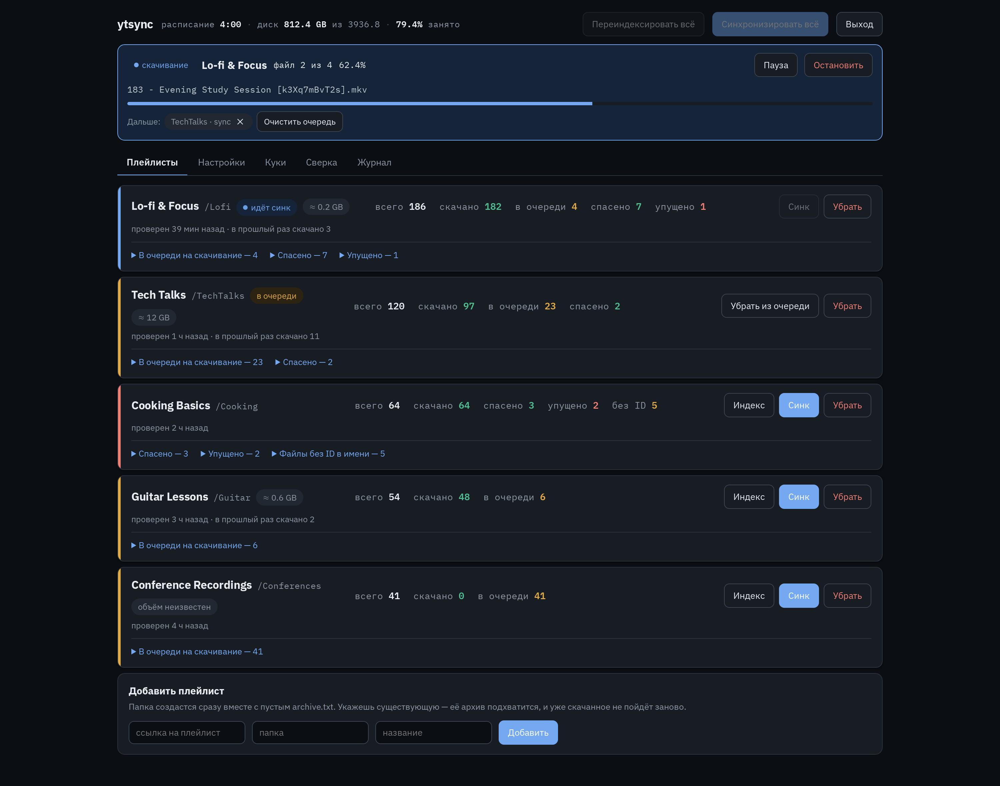

<div align="center">

# ytsync

**Архиватор плейлистов YouTube, который не заставляет качать заново то, что у вас уже есть.**

[](https://github.com/BasteArima/ytsync/actions/workflows/docker-publish.yml)
[](https://github.com/BasteArima/ytsync/pkgs/container/ytsync)
[](LICENSE)

[English](README.md) · [Русский](README.ru.md)



</div>

---

Следит за плейлистами по расписанию, докачивает новое и показывает, что пропало
с YouTube, — чтобы было видно, какие видео архив успел спасти до удаления.

Работает поверх `yt-dlp`. Намеренно маленький: Flask и SQLite, без Elasticsearch
и брокеров сообщений, одна загрузка за раз. В покое ест несколько десятков МБ.

## Зачем ещё один

Большинство архиваторов хотят владеть вашей библиотекой. Pinchflat
[прямо пишет](https://github.com/kieraneglin/pinchflat/wiki/Frequently-Asked-Questions),
что импорт существующей библиотеки *«не поддерживается и не планируется»*;
у TubeSync и ChannelTube это просто не задокументировано. Если на диске уже лежат
сотни видео, такие инструменты скачают их заново.

> **ytsync считает источником правды сам файл `--download-archive` от `yt-dlp`.**

Укажите папку, в которой уже есть `archive.txt`, — и работа продолжится ровно с
того места, где остановились. ID видео дополнительно восстанавливаются из имён
вида `Название [dQw4w9WgXcQ].mkv`, поэтому папка без файла архива обычно тоже
опознаётся. Существующие файлы не изменяются.

## Возможности

| | |
|---|---|
| **Синк по расписанию** | Проверяет каждый плейлист в заданные часы. |
| **Честный учёт** | Каждое видео — *скачано*, *в очереди*, *спасено* (пропало с YouTube, но лежит у вас) или *упущено* (пропало раньше, чем успели). |
| **Записи-призраки** | Удалённые видео навсегда остаются в плейлисте YouTube. ytsync их распознаёт, а не показывает вечно «не хватает». |
| **Живой прогресс** | Текущий файл, проценты, пауза и остановка. После остановки остаётся `.part`, который продолжится, а не начнётся заново. |
| **Видимая очередь** | Одна загрузка за раз намеренно; очередь видна и редактируема, повторное нажатие «Синк» не создаёт дубль. |
| **Порог места** | Не начинает скачивание, если свободного меньше заданного. |
| **Тихие часы** | Не качает в часы, отданные под другие задачи. Индексация при этом работает. |
| **Повтор упущенных** | Часть отказов временная, а не удаление. |
| **Мастер сверки** | Для файлов без ID в имени подбирает похожие по названию и дописывает подтверждённые в `archive.txt`. |
| **Вход по паролю** | Задаётся при первом запуске, помнится полгода в каждом браузере. |
| **Русский и английский** | Переключаются в настройках вместе с темой и масштабом. |

Дружит с медиасерверами: файлы ложатся в вашу структуру папок и склеиваются в
`mkv` без перекодирования.

## Быстрый старт

```yaml
# docker-compose.yml
services:
  ytsync:
    image: ghcr.io/bastearima/ytsync:latest
    container_name: ytsync
    restart: unless-stopped
    user: "1000:1000"          # должен иметь право писать в папку с медиа
    ports:
      - "8099:8099"
    environment:
      TZ: "Europe/Moscow"
    volumes:
      - /srv/media/YouTube:/media
      - ytsync_config:/config

volumes:
  ytsync_config:
```

```sh
docker compose up -d
```

Откройте `http://<хост>:8099`, задайте пароль, добавьте плейлист.

> Добавление плейлиста только **индексирует** его. Пока не нажата кнопка
> **Синк**, ничего не скачивается — первый запуск всегда безопасен.

Подпапки внутри `/media` — это плейлисты. Укажите новому плейлисту существующую
папку, и её `archive.txt` будет использован как есть.

### Права

Контейнер пишет файлы от того `user:`, который вы укажете. Ставьте тот же
UID:GID, под которым работает ваш медиасервер, иначе он не прочитает скачанное.

## Настройки

Всё задаётся в веб-интерфейсе и хранится в `/config/config.json`.

| Параметр | По умолчанию | Примечание |
|---|---|---|
| Часы запуска | `4` | через запятую, местное время (задайте `TZ`) |
| Тихие часы | — | в эти часы скачивание не идёт |
| Минимум свободного места | `100` ГБ | ниже порога синк не стартует |
| Ограничение скорости | — | передаётся в `yt-dlp --limit-rate`, например `5M` |
| Формат | — | пусто означает лучшее видео плюс лучший звук |
| Шаблон имени | `%(playlist_index)s - %(title)s [%(id)s].%(ext)s` | оставьте `[%(id)s]`, чтобы файлы оставались опознаваемыми |

Куки нужны только для приватных плейлистов и видео с возрастным ограничением;
загружаются через интерфейс. Всё, что не относится к доменам YouTube и Google,
отбрасывается при сохранении: полный дамп кук браузера содержит сессии ко всем
сайтам подряд, и на сервере ему делать нечего.

## Безопасность

TLS нет, это инструмент для локальной сети. Вход — один пароль, хранится как хеш
PBKDF2-SHA256 со случайной солью; кука сессии подписана HMAC и помечена
`HttpOnly`. Если открываете доступ наружу, ставьте перед сервисом обратный
прокси с TLS.

## Что стоит знать

- **Нужен JavaScript-движок**, он включён в образ (Deno). YouTube требует решать
  JS-задачи, чтобы отдать ссылки на потоки; без движка `yt-dlp` видит только
  раскадровки и сообщает `Requested format is not available` — выглядит ровно как
  удалённое видео, хотя таковым не является. Скрипты решения подтягивает
  дополнение `yt-dlp[default]`.
- **Удалённое видео нельзя сопоставить по содержимому.** Для YouTube нет базы
  хешей, как для аниме; единственный надёжный идентификатор — 11-символьный ID.
  Поэтому мастер сверки просит подтверждения, а не решает сам.
- **Одна загрузка за раз** — намеренно, чтобы щадить слабые домашние серверы.
- **Журнал тоже переведён.** Сервер хранит ключ сообщения и его параметры, а не
  готовый текст, поэтому одна и та же запись читается на выбранном языке. Сырой
  вывод `yt-dlp` проходит как есть, а записи, сделанные до этой правки,
  сохраняют прежние формулировки.

## Разработка

```sh
docker build -t ytsync .
docker run --rm -p 8099:8099 -v ./config:/config -v ./media:/media ytsync
```

- `core.py` — yt-dlp, логика архива и статистика по плейлистам
- `extras.py` — аутентификация и подбор соответствий для сверки
- `app.py` — очередь, планировщик и HTTP-слой

## Лицензия

MIT — см. [LICENSE](LICENSE). Встроенные шрифты IBM Plex распространяются
отдельно, под SIL Open Font License 1.1.
